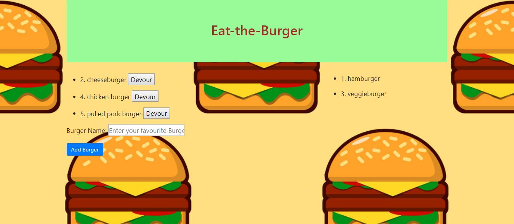

# Eat the Burger
### Overview
Eat the Burger app is a burger logger with MySQL, Node, Express, Handlebars and a homemade ORM (yum!). Be sure to follow the MVC design pattern; use Node and MySQL to query and route data in your app, and Handlebars to generate your HTML.



### Application Heroku Link
The link below will give you direct access to Eat the burger app using your browser via the Heroku web service.

* [Eat-the-Burger] (https://protected-hollows-70193.herokuapp.com/)


### This App is built With following npm Installations  and Programming languages

* [Node.js] (https://nodejs.org/en/)

* [JavaScript] (https://www.javascript.com/)

* [JQUERY]  (https://jquery.com/)

* [Handlebars] (https://handlebarsjs.com)

* [Mysql] (https://www.mysql.com/)


* [Express.js]	(https://expressjs.com/)


### How to run the App

1. clone my repo using the command line
```
 * git clone https://github.com/sathishbaburaj/Eat-the-Burger.git
```

2. Change the directory to the cloned repo folder.
```
* cd Eat-the-Burger
```
3. Install the required npm packages
```
 * npm install
```
 4. Start the application server using the command line  below
```
 * node server.js
 ```
 


